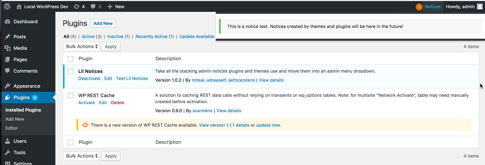

# Lil' Notices

Admin notices can get really annoying. Make them better.

# Basic Usage

##Installation

###Automated remote installation
* We recommend you install this plugin using [GitHub Updater remote installations](https://github.com/afragen/github-updater/blob/develop/README.md#remote-installation-of-repositories)

###Manual Installation

1. Download the latest [tagged archive](https://github.com/afragen/github-updater/releases) (choose the "zip" option).
2. Unzip the archive, rename the folder correctly to `github-updater`, then re-zip the file.
3. Go to the __Plugins -> Add New__ screen and click the __Upload__ tab.
4. Upload the zipped archive directly.
5. Go to the Plugins screen and click __Activate__.

## Advanced Options
* There are no UIX options related to this plugin, its just plug-and-play

# How it works details
## Summary
This plugin has no options page, it simply runs on the wp-admin (backend) of your website and moves all the notices that plugins and themes would have created at the top of your page, and instead moves them into a lil dropdown menu in the wp-admin bar. 

